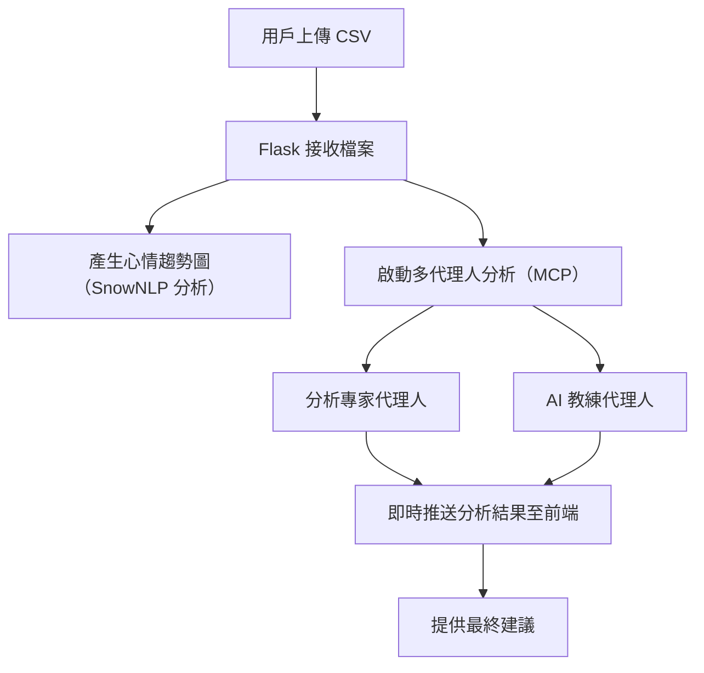

# 📄 心情日記多代理人分析系統

基於 Flask + SocketIO 實作的 **心情日記多代理人協作分析系統**，  
後端使用 **Model Context Protocol (MCP)**，可靈活切換不同大型語言模型（Gemini、OpenAI、HuggingFace）。

---

## 🚀 主要特色

- **上傳心情日記 CSV** ➔ 自動分析心情趨勢與生成行動建議
- **多代理人協作分析** ➔ 分析專家 + AI 教練
- **即時互動回饋** ➔ 透過 WebSocket (SocketIO) 即時推送訊息
- **彈性模型切換** ➔ 支援 Gemini、OpenAI、HuggingFace 模型
- **美觀心情趨勢圖** ➔ 使用 SnowNLP 分析情緒並繪製曲線圖

---

## 🛠️ 專案結構說明

| 檔案 | 說明 |
|:---|:---|
| `app.py` | 主 Flask 伺服器與 SocketIO 即時互動 |
| `config.py` | 環境變數與模型設定管理 |
| `multiagent.py` | 多代理人協作流程（使用 MCP 架構） |
| `mcp.py` | Model-Context-Protocol 定義（模型、上下文、代理人） |
| `EMOwithSnow.py` | 使用 SnowNLP 分析心情並繪製心情趨勢圖 |
| `templates/index.html` | （請自行新增）前端上傳與即時顯示介面 |

---

## ⚙️ 安裝與啟動

### 1. 安裝必要套件

```bash
pip install -r requirements.txt
```

必要套件包含：

- Flask
- Flask-SocketIO
- pandas
- python-dotenv
- matplotlib
- seaborn
- snownlp
- openai
- google-generativeai
- requests

### 2. 建立 `.env` 檔案

```dotenv
# 模型提供者設定：gemini / openai / hf
MODEL_PROVIDER=gemini

# 預設使用的模型版本
DEFAULT_MODEL=gemini-2.5-pro-exp-03-25

# API 金鑰設定
GEMINI_API_KEY=你的_gemini_api_key
OPENAI_API_KEY=你的_openai_api_key
HF_API_KEY=你的_huggingface_api_key

# 除錯模式（可選）
DEBUG_MODE=false
```

> 📌 注意：建議使用 `gemini-2.5-pro-exp-03-25`，避免使用無免費額度的 Preview 版本！

### 3. 啟動伺服器

```bash
python app.py
```

伺服器將會啟動於：[http://localhost:5000](http://localhost:5000)

---

## 📤 使用流程

1. 打開瀏覽器進入首頁，上傳心情日記的 CSV 檔案。
2. 系統自動產生心情趨勢圖，並即時顯示在前端。
3. 啟動多代理人協作分析，並逐步即時推送分析結果。
4. 最終提供個性化的正向行動建議。

---

## 📄 上傳 CSV 格式要求

CSV 檔案需包含以下欄位：

| 欄位名稱 | 說明 |
|:---|:---|
| `日期` | 日記紀錄日期 |
| `心情指數` | 用戶自行記錄的心情分數（數字） |
| `心情小語` | 一段描述心情的文字（進行情緒分析） |

範例：

| 日期 | 心情指數 | 心情小語 |
|:---|:---|:---|
| 2024-01-01 | 7 | 今天心情很好，天氣超棒。 |
| 2024-01-02 | 5 | 有點疲倦，但還算可以。 |

---

## 🧠 系統架構流程圖



---

## 🛡️ 注意事項

- **免費額度限制**：使用 Gemini API 時，請注意每日免費額度上限。若遇到 429 錯誤（RESOURCE_EXHAUSTED），可改用 OpenAI 或 HuggingFace。
- **自動切換模型（未來功能）**：可擴充偵測模型額度用盡時，自動切換到備援模型。
- **每個代理人擁有獨立上下文**：分析專家與 AI 教練各自擁有自己的對話記憶，提升互動真實感。